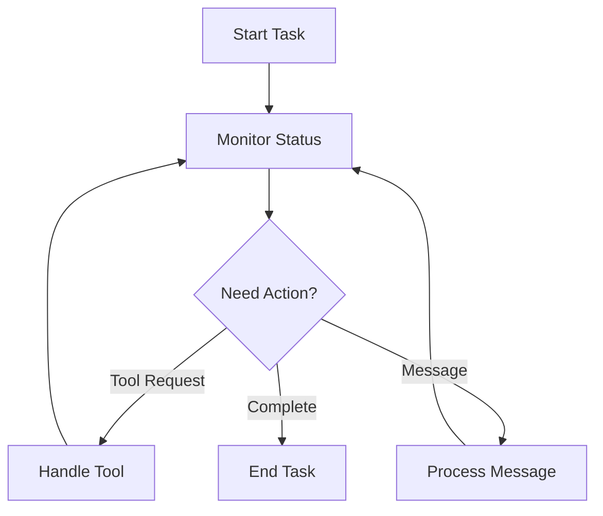

# AI Agent Integration Guide

## Overview

This guide explains how to create AI agents that can effectively use Cline's external API to perform software development tasks.

## Core Concepts

### 1. Task Lifecycle



### 2. State Management

Your agent should track:
- Active task state
- Tool use context
- Browser sessions
- Message history
- UI state

## Implementation Patterns

### 1. Basic Agent Structure

```typescript
class ClineAgent {
    private baseUrl = 'http://localhost:7777';
    private currentTask: string | null = null;
    private browserActive = false;

    async executeTask(task: string) {
        // Start task
        await this.startTask(task);
        
        // Monitor until complete
        while (await this.isTaskActive()) {
            await this.handleCurrentState();
            await this.delay(1000);
        }
    }

    private async handleCurrentState() {
        const status = await this.getStatus();
        
        if (this.needsToolApproval(status)) {
            await this.handleToolRequest(status);
        }
        
        if (this.needsFeedback(status)) {
            await this.provideFeedback(status);
        }
    }
}
```

### 2. Tool Use Pattern

```typescript
class ClineAgent {
    private async handleToolRequest(status: any) {
        const tool = this.extractToolInfo(status);
        
        // Always close browser before other tools
        if (this.browserActive && tool.name !== 'browser_action') {
            await this.closeBrowser();
        }
        
        // Analyze tool request
        const shouldApprove = this.analyzeToolRequest(tool);
        
        if (shouldApprove) {
            await this.approveToolUse();
        } else {
            await this.rejectWithFeedback(
                "Try this approach instead..."
            );
        }
    }

    private async closeBrowser() {
        await fetch(`${this.baseUrl}/browser_action`, {
            method: 'POST',
            body: JSON.stringify({
                action: 'close'
            })
        });
        this.browserActive = false;
    }
}
```

### 3. Visual Analysis Pattern

```typescript
class ClineAgent {
    private async analyzeVisualResult() {
        // Capture current state
        const screenshot = await this.captureScreenshot();
        
        // Analyze with specific instructions
        await this.sendMessage(
            "Analyze this result and verify:", 
            [screenshot]
        );
        
        // Wait for analysis
        const analysis = await this.waitForCompletion();
        
        // Act on analysis
        return this.processAnalysis(analysis);
    }

    private async captureScreenshot() {
        const response = await fetch(`${this.baseUrl}/screenshot`, {
            method: 'POST',
            body: JSON.stringify({
                type: 'webpage',
                url: 'http://localhost:3000',
                fullPage: true
            })
        });
        
        const result = await response.json();
        return result.data.image;
    }
}
```

## Best Practices

### 1. State Tracking

Always maintain context:
```typescript
class ClineAgent {
    private context = {
        lastToolUse: null,
        messageHistory: [],
        browserState: {
            active: false,
            currentUrl: null
        },
        metrics: {
            tokenCount: 0,
            toolUseCount: 0
        }
    };

    private async updateContext(status: any) {
        this.context.browserState.active = 
            status.browserSessions.length > 0;
        this.context.metrics.tokenCount = 
            status.apiMetrics.totalTokensIn + 
            status.apiMetrics.totalTokensOut;
    }
}
```

### 2. Error Recovery

Implement robust error handling:
```typescript
class ClineAgent {
    private async handleError(error: any) {
        // Clean up state
        if (this.context.browserState.active) {
            await this.closeBrowser();
        }

        // Log error context
        console.error('Error context:', {
            lastState: this.context,
            error: error
        });

        // Attempt recovery
        await this.recoverFromError(error);
    }

    private async recoverFromError(error: any) {
        if (error.type === 'tool_failure') {
            await this.suggestAlternative();
        } else if (error.type === 'api_error') {
            await this.retryWithBackoff();
        }
    }
}
```

### 3. Resource Management

Monitor and manage resources:
```typescript
class ClineAgent {
    private async checkResources() {
        const status = await this.getStatus();
        
        // Check token usage
        if (this.isApproachingLimit(status.apiMetrics)) {
            await this.optimizeTokenUsage();
        }
        
        // Check browser sessions
        if (status.browserSessions.length > 1) {
            await this.cleanupBrowserSessions();
        }
    }

    private isApproachingLimit(metrics: any) {
        return metrics.totalTokensIn + metrics.totalTokensOut > 
            this.TOKEN_LIMIT * 0.8;
    }
}
```

## Advanced Patterns

### 1. Progressive Enhancement

```typescript
class ClineAgent {
    private async enhanceResult() {
        let result = await this.getBasicResult();
        
        // Iteratively improve
        while (this.canEnhance(result)) {
            const suggestion = await this.analyzePotentialImprovements(result);
            if (suggestion) {
                await this.applyEnhancement(suggestion);
                result = await this.getCurrentResult();
            } else {
                break;
            }
        }
        
        return result;
    }
}
```

### 2. Contextual Decision Making

```typescript
class ClineAgent {
    private async decideNextAction(status: any) {
        const context = {
            taskProgress: this.analyzeProgress(status),
            toolHistory: this.context.toolUseHistory,
            currentState: status.taskStatus,
            metrics: status.apiMetrics
        };

        return this.selectBestAction(context);
    }

    private analyzeProgress(status: any) {
        // Analyze message patterns
        // Check tool use effectiveness
        // Evaluate current direction
        return progressAnalysis;
    }
}
```

### 3. Feedback Loop

```typescript
class ClineAgent {
    private async provideFeedback(result: any) {
        // Analyze result quality
        const analysis = await this.analyzeResult(result);
        
        // Provide specific feedback
        if (analysis.needsImprovement) {
            await this.sendMessage(
                this.formatFeedback(analysis.suggestions)
            );
        } else {
            await this.approveResult();
        }
    }

    private async analyzeResult(result: any) {
        // Check against requirements
        // Verify implementation
        // Assess quality
        return analysis;
    }
}
```

## Tips for AI Agent Development

1. Always maintain task context
2. Handle tool transitions carefully
3. Implement proper cleanup
4. Monitor resource usage
5. Provide clear feedback
6. Handle errors gracefully
7. Track metrics
8. Test edge cases

## Common Pitfalls

1. Not closing browser before other tools
2. Missing error states
3. Incomplete cleanup
4. Token limit issues
5. Unclear feedback
6. Lost context
7. Race conditions
8. Resource leaks

## Testing Your Agent

1. Test basic flow
2. Test error handling
3. Test resource management
4. Test edge cases
5. Test recovery
6. Test cleanup
7. Test metrics
8. Test feedback

## Metrics to Track

1. Task completion rate
2. Token usage
3. Tool use effectiveness
4. Error recovery rate
5. Feedback quality
6. Resource efficiency
7. Time to completion
8. Enhancement success
